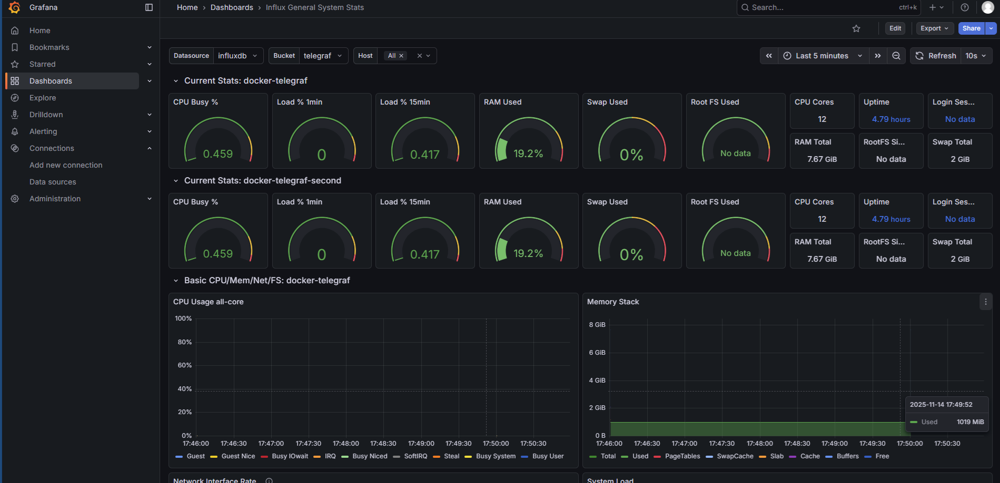

# OPC UA → Telegraf → InfluxDB → Grafana Docker Pipeline

Full industrial data pipeline using OPC UA → Telegraf → InfluxDB → Grafana, fully containerized with Docker for easy deployment, testing, and scalability.

##  Industrial Data Pipeline Overview

This repository provides a complete containerized solution for collecting, processing, and visualizing industrial data from OPC UA servers through a modern time-series data pipeline.

### Architecture

```
OPC UA Servers → Telegraf → InfluxDB → Grafana
                    ↓
            Prometheus/Node Exporter
```

##  Quick Start

### Prerequisites

- Docker and Docker Compose installed
- At least 4GB RAM available
- Ports 3000, 8086, 9090, 9100, 8080, 8125, 8126 available

### Clone and Deploy

```bash
git clone https://github.com/SobhanRjz/opcua-telegraf-influxdb-grafana-docker.git
cd opcua-telegraf-influxdb-grafana-docker
docker-compose up -d
```

### Access Interfaces

- **Grafana**: http://localhost:3000 (admin/admin)
- **InfluxDB**: http://localhost:8086
- **Prometheus**: http://localhost:9090
- **Nginx**: http://localhost:8080

##  Services Included

| Service | Image | Purpose |
|---------|-------|---------|
| **InfluxDB** | `influxdb:2.7.12` | Time-series database for storing industrial metrics |
| **Telegraf** | `telegraf:1.36.3` | Data collection agent (2 instances for redundancy) |
| **Grafana** | `grafana/grafana:12.3.0-18578466485` | Visualization and dashboard platform |
| **Prometheus** | `prom/prometheus:v3.7.3` | Monitoring and alerting system |
| **Node Exporter** | `prom/node-exporter:v1.10.2` | Host system metrics exporter |
| **Nginx** | `nginx:1.29.3-alpine3.22-slim` | Web server and reverse proxy |

## ⚙️ Configuration

### OPC UA Data Collection

Telegraf is configured to collect data from OPC UA servers. Configuration files are located in the `telegraf/` directory:

- `telegraf.conf` - Main Telegraf configuration for OPC UA and system metrics
- `telegraf_second.conf` - Secondary Telegraf instance for additional StatsD input

### Environment Variables

Key environment variables for the pipeline:

```yaml
# InfluxDB Setup
DOCKER_INFLUXDB_INIT_MODE: setup
DOCKER_INFLUXDB_INIT_USERNAME: admin
DOCKER_INFLUXDB_INIT_PASSWORD: admin_password
DOCKER_INFLUXDB_INIT_ORG: local-org
DOCKER_INFLUXDB_INIT_BUCKET: telegraf

# Telegraf
INFLUX_TOKEN: local-admin-token

# Grafana
GF_SECURITY_ADMIN_USER: admin
GF_SECURITY_ADMIN_PASSWORD: admin
```

##  Data Flow

1. **OPC UA Servers** → Industrial devices and PLCs send data via OPC UA protocol
2. **Telegraf** → Collects, processes, and transforms industrial data
3. **InfluxDB** → Stores time-series data with high performance
4. **Grafana** → Provides real-time visualization and dashboards
5. **Prometheus** → Monitors the pipeline health and performance



## 🔧 Usage Guide

### Starting the Pipeline

```bash
# Start all services
docker-compose up -d

# View service status
docker-compose ps

# View logs
docker-compose logs -f [service_name]
```

### Configuring OPC UA Sources

1. Edit `telegraf/telegraf.conf` to add your OPC UA server endpoints
2. Configure authentication and data points to collect
3. Restart Telegraf: `docker-compose restart telegraf`

### Creating Grafana Dashboards

1. Access Grafana at http://localhost:3000
2. Add InfluxDB as a data source (URL: http://influxdb:8086)
3. Import dashboard templates from the `grafana/` directory
4. Create custom panels for your industrial metrics

## Project Structure

```
opcua-telegraf-influxdb-grafana-docker/
├── docker-compose.yml          # Main orchestration file
├── prometheus.yml              # Prometheus configuration
├── telegraf/                   # Telegraf configurations
│   ├── telegraf.conf          # Main Telegraf config
│   └── telegraf_second.conf   # Secondary Telegraf config
├── grafana/                    # Grafana dashboard templates
├── nginx/                      # Nginx configuration
├── docs/                       # Documentation and guides
└── README.md                   # This file
```

## 🛠️ Development and Testing

### Local Development

```bash
# Build and start services
docker-compose up --build

# Run in development mode with logs
docker-compose up
```

### Scaling Telegraf Instances

```bash
# Scale to 3 Telegraf instances
docker-compose up -d --scale telegraf=3
```

## Documentation

- [Telegraf OPC UA Plugin Documentation](docs/explaining_telegraf.md)
- [Installation Guides](docs/) for different platforms
- [Grafana Dashboard Examples](grafana/)

## Contributing

Contributions are welcome! Please:

1. Fork the repository
2. Create a feature branch
3. Make your changes
4. Test thoroughly
5. Submit a pull request

## ⚠️ Security Notice

- Change default passwords before production deployment
- Review and configure firewall rules
- Monitor access logs regularly
- See [SECURITY.md](SECURITY.md) for detailed security guidelines
